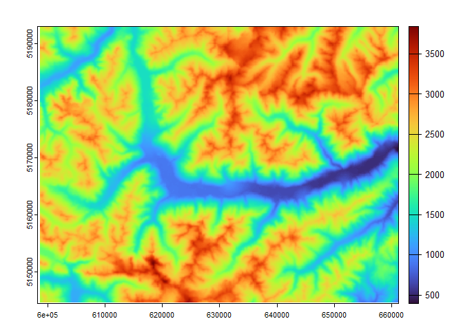
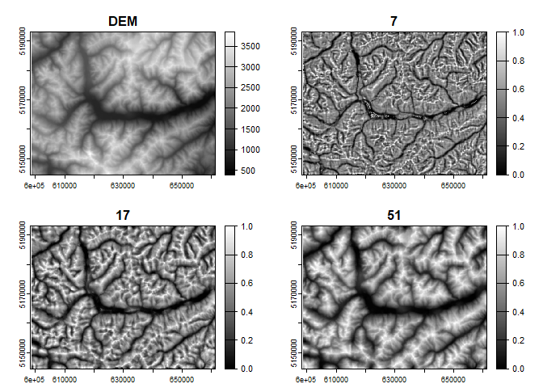
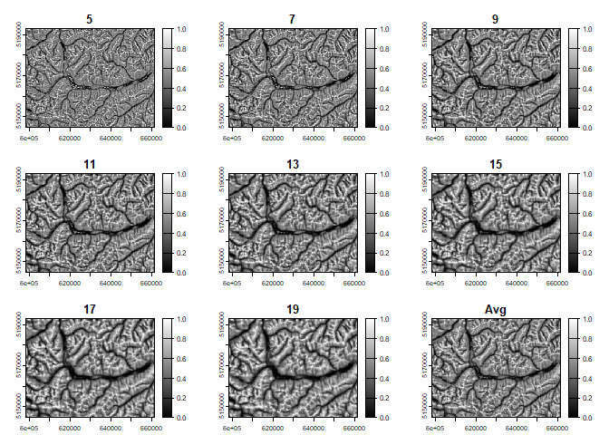
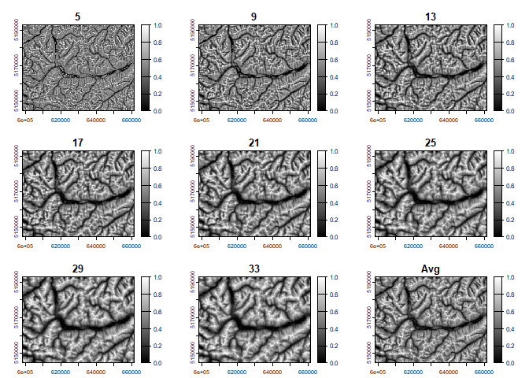

<!-- README.md is generated from README.Rmd. Please edit that file -->

# RSExtraction

<!-- badges: start -->
<!-- badges: end -->

The goal of RSExtraction is to provide a resource to perform analysis
presented in Lehner et al. (2024). Currently, this methodology is
developed for DEM datasets projected in UTM. Other coordinate systems
can be used, although the unit vector surfaces are unreliable due to the
discrepancy between lat/long degrees vs meters between the planar extent
and elevation values. Limited testing has shown that the ridge and swale
features extracted do not appear to be greatly affected and seem
reliable.

## Installation

You can install the development version of RRExtraction from
[GitHub](https://github.com/) with:

``` r
# install.packages("pak")
pak::pak("jacoblehner/RRExtraction")
```

## Example usage:

``` r
# Load libraries
library(RRExtraction)
library(terra)
library(viridis)

# Load your DEM using terra package
data <- rast("/path/to/DEM")

# Extract RR for given scale (e.g., 7)
rr7 <- relRelief(inRas = data, sc = 7) # Scale = 7

# Extract RR for scales between 2 scales with a sequence step and the average RR
rr.Avg5.19.2 <- rr.Average(inRas = data, inMn = 5, inMx = 19, stp=2)

# Example of writing features to file
writeRaster(rr7, filename="/path/to/dir/RR_7.tif", overwrite = T)
writeRaster(rs.Rasts, filename="/path/to/dir/avgRR_5_19_2.tif", overwrite = T)
```

## Example 1: Relative relief at distinct scales

``` r
library(RRExtraction)
library(terra)
#> terra 1.8.29
library(viridis)
#> Loading required package: viridisLite
f <- system.file("ex/elev_vinschgau.tif", package="terra")
r <- rast(f) 
a <- disagg(r, 2.5)
data <- resample(r, a, "bilinear")
plot(data, col=turbo(200), legend = T)
```



``` r

# Scale of X * raster resolution
rr7 <- relRelief(inRas = data, sc = 7) # Scale = 7
rr17 <- relRelief(inRas = data, sc = 17) # Scale = 17
rr51 <- relRelief(inRas = data, sc = 51) # Scale = 51

rrSamples <- c(data, rr7, rr17, rr51)
names(rrSamples) <- c('DEM', '7', '17', '51')
plot(rrSamples, col=gray(1:200/200))
```



## Example 2: Relative relief at various scales and the average

``` r
library(RRExtraction)
library(terra)
library(viridis)
f <- system.file("ex/elev_vinschgau.tif", package="terra")
r <- rast(f) 
a <- disagg(r, 2.5)
data <- resample(r, a, "bilinear")
plot(data, col=turbo(200), legend = T)
```


``` r

# Get RR for scales between a 5 and 19 scale stepping by 2 and the average RR
rr.Avg5.19.2 <- rr.Average(inRas = data, inMn = 5, inMx = 19, stp=2)
#> Scale: 5 Scale: 7 Scale: 9 Scale: 11 Scale: 13 Scale: 15 Scale: 17 Scale: 19 
plot(rr.Avg5.19.2, col=gray(1:200/200))
```



``` r

# Get RR for scales between a 5 and 33 scale stepping by 4 and the average RR
rr.Avg5.33.4 <- rr.Average(inRas = data, inMn = 5, inMx = 33, stp=4)
#> Scale: 5 Scale: 9 Scale: 13 Scale: 17 Scale: 21 Scale: 25 Scale: 29 Scale: 33 
plot(rr.Avg5.33.4, col=gray(1:200/200))
```


